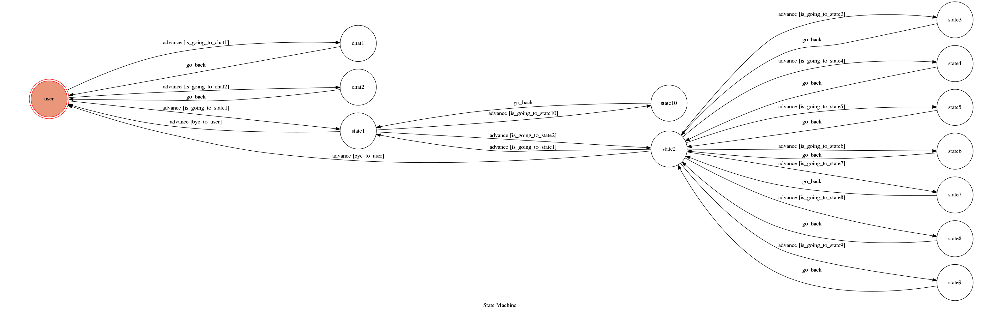

# TOC Project 2017

This project is a chatbot that you can search for game schedule of the Super Basketball League(SBL) in Taiwan.

## Setup

### Prerequisite
* Python 3
* Mongo DB

#### Install Dependency
```sh
pip install -r requirements.txt
```

* pygraphviz (For visualizing Finite State Machine)
    * [Setup pygraphviz on Ubuntu](http://www.jianshu.com/p/a3da7ecc5303)

### Secret Data

`WEBHOOK_URL` in app.py **MUST** be set to proper values.
Otherwise, you might not be able to run the code.

### Run Locally
You can either setup https server or using `ngrok` as a proxy.

**`ngrok` would be used in the following instruction**

```sh
ngrok http 5000
```

After that, `ngrok` would generate a https URL.

You should set `WEBHOOK_URL` (in app.py) to `your-https-URL/hook`.

#### Run the sever

```sh
python3 app.py
```

## Finite State Machine


## Usage
The initial state is set to `user`.

總共有user, chat1, chat2和其他10個states
* user輸入"嗨" ->進入state1
* user輸入"show fsm" ->進入chat1，印出state diagram
* user輸入"簡單介紹一下你自己" ->進入chat2，她會簡單介紹她自己
* state1輸入"查賽程"->進入state2
* state1輸入"查戰績"->進入state10，印出當前戰績

**State3~State9是sbl的七支球隊**
* 從state2輸入隊名會進入3～9其中一個，然後印出該球隊近期的賽程

## Author
[Shih-Yu](https://github.com/)
